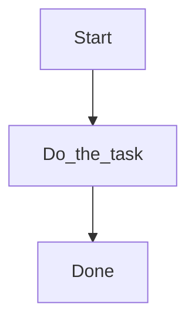

# Task page template

Copy this file into a phase folder and rename it (for example `offices.md`).

---

# [Task title]

**Required for day-to-day** | **Configure later**

## Goal

One sentence: what the reader will have accomplished.

## Who

Administrator (Volume 1) — or a day-to-day role in Volume 2.

## Before you start

- Prerequisites (earlier phases, data that must already exist)
- Permissions or role needed (plain language)

## Flow

## Steps

1. …
2. …

<!-- Screenshot: docs/user-guide/assets/admin/<phase>/01-example.png -->
<!--  -->

## What good looks like

- Success signals the reader can see in the UI

## If something goes wrong

| What you see | What to try |
|--------------|-------------|
| … | … |

## Related

- Previous: …
- Next: …
