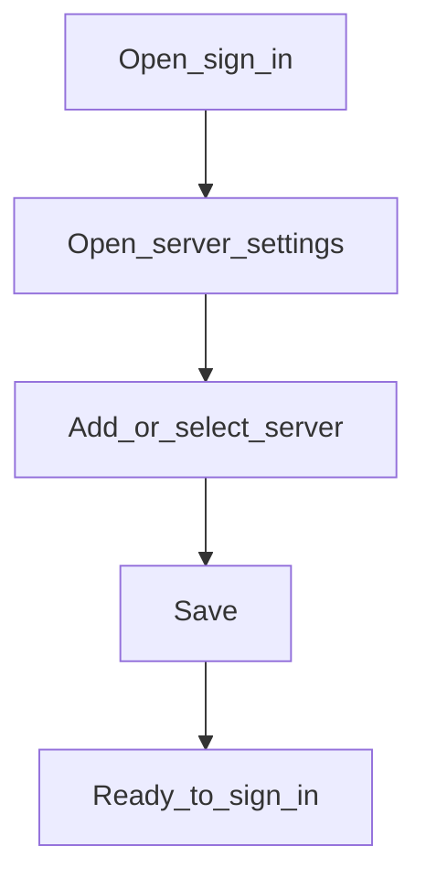

# Add or select a server

**Required for day-to-day**

## Goal

Connect the app to your institution’s backend so you can sign in against the right environment.

## Who

Administrator

## Before you start

- The backend URL (and tenant, if your institution uses one) from your implementation team
- Network access to that server

## Flow

## Steps

1. Open the sign-in page (`/login`).
2. Open **Servers** (or use `/login?servers=1` / later **Settings → Servers** at `/settings/servers`).
3. Add a new server with a clear display name and the backend base URL, or select an existing one.
4. Save and return to sign-in. Confirm the active server name matches the environment you intend (sandbox vs production).

<!-- Screenshot: docs/user-guide/assets/admin/00-access-and-servers/01-server-list.png -->
**Screenshot placeholder:** `assets/admin/00-access-and-servers/01-server-list.png` — server list with one active entry.

<!-- Screenshot: docs/user-guide/assets/admin/00-access-and-servers/02-add-server.png -->
**Screenshot placeholder:** `assets/admin/00-access-and-servers/02-add-server.png` — add-server form.

## What good looks like

- The intended server is selected as current
- Sign-in form is available without a “no server configured” message

## If something goes wrong

| What you see | What to try |
|--------------|-------------|
| Cannot reach server | Check URL, VPN, and TLS; ask IT to confirm the backend is up |
| Wrong institution after sign-in | Reselect the correct server before signing in again |

## Related

- Next: [Sign in](sign-in.md)
