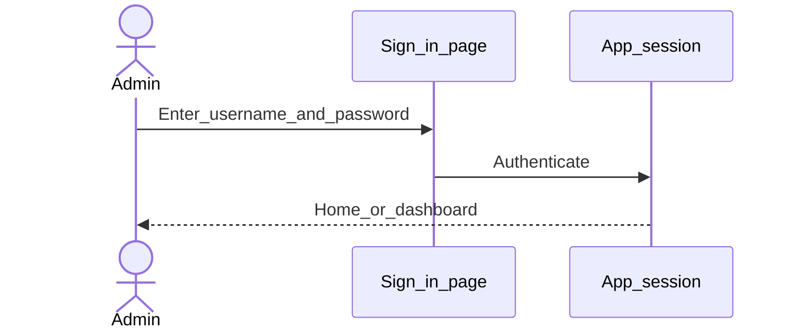

# Sign in

**Required for day-to-day**

## Goal

Authenticate as an administrator so you can configure the institution.

## Who

Administrator

## Before you start

- [Server selected](servers.md)
- Username and password for an admin account

## Flow

## Steps

1. On `/login`, confirm the correct server is active.
2. Enter username and password.
3. Submit. You should land in the main application shell (sidebar navigation visible).

<!-- Screenshot: docs/user-guide/assets/admin/00-access-and-servers/03-sign-in.png -->
**Screenshot placeholder:** `assets/admin/00-access-and-servers/03-sign-in.png` — sign-in form with server indicator.

## What good looks like

- Sidebar shows Administration, System, Organization, and related groups
- No repeated redirect back to sign-in

## If something goes wrong

| What you see | What to try |
|--------------|-------------|
| Invalid credentials | Reset password via your ops process; confirm Caps Lock / tenant |
| Signed out quickly | Check idle timeout under Global configurations after you gain access |

## Related

- Previous: [Add or select a server](servers.md)
- Next phase: [System foundations](../01-system-foundations/README.md)
