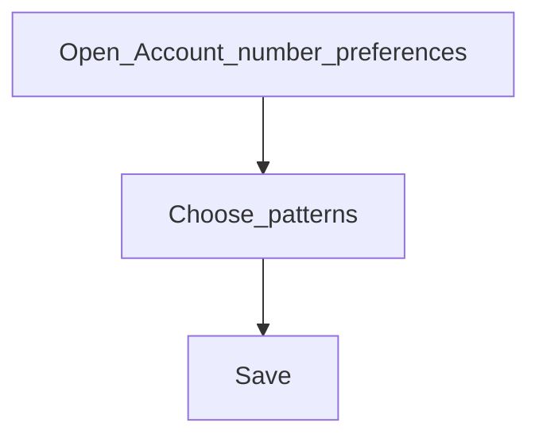

# Account number preferences

**Configure later**

## Goal

Control how account numbers are generated for products and accounts.

## Who

Administrator

## Before you start

- Products planned (you can refine numbering after products exist)

## Flow

## Steps

1. Go to **System → Account number preferences** (`/system/account-number-preferences`).
2. Review patterns for the account types you will use.
3. Save changes before opening large volumes of accounts in production.

<!-- Screenshot: docs/user-guide/assets/admin/01-system-foundations/04-account-number-preferences.png -->
**Screenshot placeholder:** `assets/admin/01-system-foundations/04-account-number-preferences.png`

## What good looks like

- New accounts receive numbers that match your numbering policy

## If something goes wrong

| What you see | What to try |
|--------------|-------------|
| Unexpected number format | Re-open preferences and confirm the account type mapping |

## Related

- Phase overview: [System foundations](README.md)
