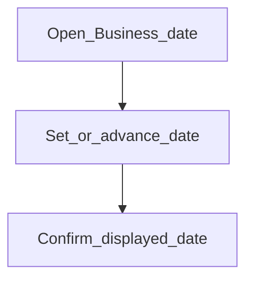

# Business date

**Required for day-to-day**

## Goal

Set the institution’s business date used for posting and operational transactions.

## Who

Administrator

## Before you start

- Understand whether you advance the business date manually or via jobs
- Global configurations reviewed as needed

## Flow

## Steps

1. Go to **System → Business date** (`/system/business-date`).
2. Review the current business date shown in the UI.
3. Update or advance according to your operating calendar (do not invent dates that skip closed periods unless intentional).
4. Confirm headers / transaction forms later use this date context.

<!-- Screenshot: docs/user-guide/assets/admin/01-system-foundations/02-business-date.png -->
**Screenshot placeholder:** `assets/admin/01-system-foundations/02-business-date.png` — business date screen.

## What good looks like

- Business date matches the day operations should post into
- Transaction forms offer that date as the default posting date

## If something goes wrong

| What you see | What to try |
|--------------|-------------|
| Transactions reject on date | Check holidays / working days; confirm business date is not in a closed period |

## Related

- Previous: [Global configurations](global-configurations.md)
- Next: [Codes](codes.md)
