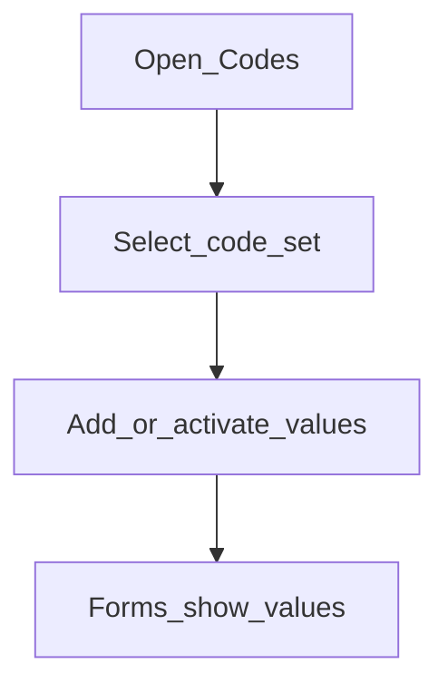

# Codes

**Required for day-to-day**

## Goal

Ensure lookup lists (genders, client types, and similar) exist so forms can offer the values your institution uses.

## Who

Administrator

## Before you start

- List of code values your policies require (from compliance / ops)

## Flow

## Steps

1. Go to **System → Codes** (`/system/codes`).
2. Open each code set you will use when creating customers and products.
3. Add missing values; deactivate obsolete ones rather than deleting if history matters.
4. Spot-check a create-customer form later to confirm values appear.

<!-- Screenshot: docs/user-guide/assets/admin/01-system-foundations/03-codes.png -->
**Screenshot placeholder:** `assets/admin/01-system-foundations/03-codes.png` — codes list and values.

## What good looks like

- Required dropdowns on customer and product forms are populated
- Naming is consistent for reports and filters

## If something goes wrong

| What you see | What to try |
|--------------|-------------|
| Empty dropdown on a form | Confirm the field uses this code set; add an active value |

## Related

- Previous: [Business date](business-date.md)
- Next phase: [Organization](../02-organization/README.md)
- Configure later: [Account number preferences](account-number-preferences.md), [External services](external-services.md)
