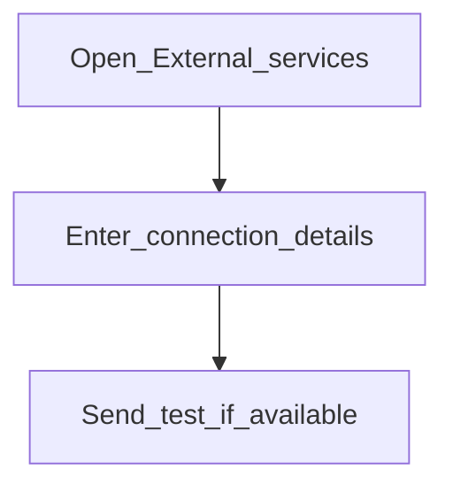

# External services

**Configure later**

## Goal

Connect email, SMS, or file storage integrations when your institution needs them.

## Who

Administrator (often with IT)

## Before you start

- Credentials and endpoints from your IT / vendor

## Flow

## Steps

1. Go to **System → External services** (`/system/external-services`).
2. Configure only the channels you will use (for example email for notifications).
3. Save and validate with a non-production test where possible.

<!-- Screenshot: docs/user-guide/assets/admin/01-system-foundations/05-external-services.png -->
**Screenshot placeholder:** `assets/admin/01-system-foundations/05-external-services.png`

## What good looks like

- Outbound messages or uploads succeed in a controlled test

## If something goes wrong

| What you see | What to try |
|--------------|-------------|
| Connection failed | Recheck host, ports, and credentials with IT |

## Related

- Phase overview: [System foundations](README.md)
