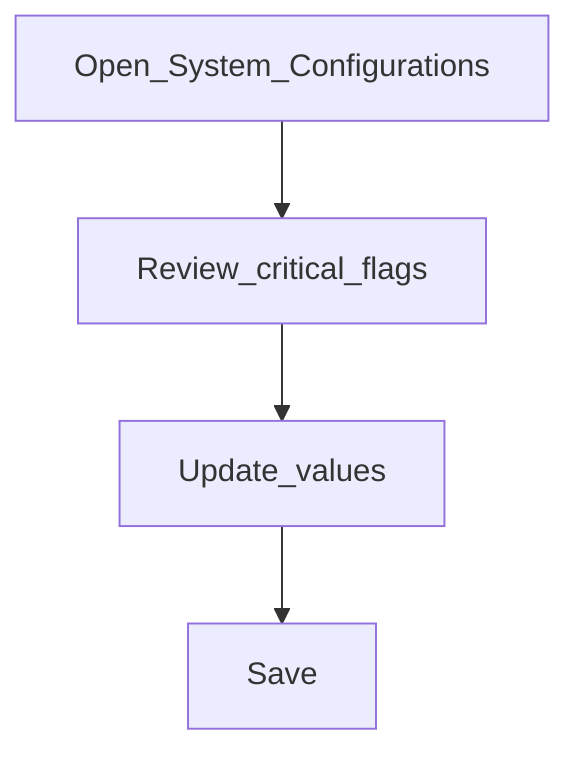

# Global configurations

**Required for day-to-day**

## Goal

Set institution-wide switches that control features, session behaviour, and processing options.

## Who

Administrator

## Before you start

- Signed in as an administrator ([Phase 0](../00-access-and-servers/sign-in.md))

## Flow

## Steps

1. Go to **System → Configurations** (`/system/configurations`).
2. Find settings that affect daily work (examples: maker-checker, approval workflows, idle session timeout, cash / teller related flags).
3. Update values deliberately — prefer change one related group at a time.
4. Save and confirm the list reflects the new values.

<!-- Screenshot: docs/user-guide/assets/admin/01-system-foundations/01-configurations-list.png -->
**Screenshot placeholder:** `assets/admin/01-system-foundations/01-configurations-list.png` — configurations list with search.

## What good looks like

- Critical flags match your operating policy
- Users are not surprised by unexpected idle logout or disabled features

## If something goes wrong

| What you see | What to try |
|--------------|-------------|
| Cannot edit a row | Confirm your role includes configuration update rights |
| Feature still off after save | Refresh; confirm you edited the correct named configuration |

## Related

- Next: [Business date](business-date.md)
