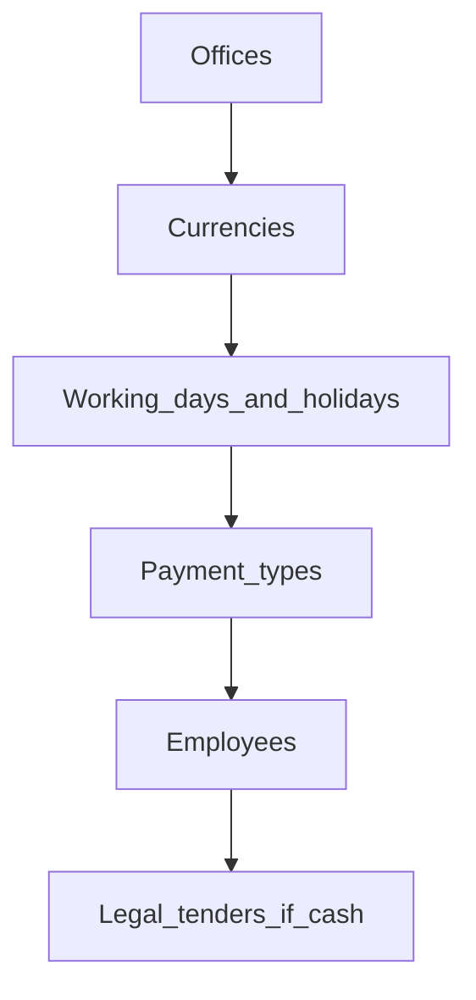

# Phase 2 — Organization structure

**Pilot chapter** — fullest example of the task-page pattern (screenshots + diagrams).

**Ready when:** branches, currencies, calendar, payment types, and a staff skeleton exist (plus legal tenders if you run cash desks).

| Task | Priority | Page |
|------|----------|------|
| Offices (branches) | Required for day-to-day | [offices.md](offices.md) |
| Currencies | Required for day-to-day | [currencies.md](currencies.md) |
| Working days | Required for day-to-day | [working-days.md](working-days.md) |
| Holidays | Required for day-to-day | [holidays.md](holidays.md) |
| Payment types | Required for day-to-day | [payment-types.md](payment-types.md) |
| Employees | Required for day-to-day | [employees.md](employees.md) |
| Legal tenders | Required when cash / tellers matter | [legal-tenders.md](legal-tenders.md) |
| Customer titles, classes, and related lookups | Configure later | [customer-lookups.md](customer-lookups.md) |
| Password preferences | Configure later | [password-preferences.md](password-preferences.md) |

## Phase flow

## Related

- Previous: [System foundations](../01-system-foundations/README.md)
- Next: [Accounting](../03-accounting/README.md)
