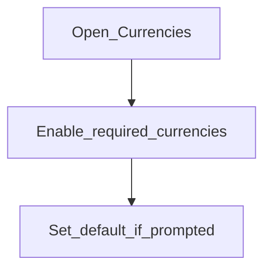

# Currencies

**Required for day-to-day**

## Goal

Enable the currencies your products and ledgers will use (for example UGX, USD).

## Who

Administrator

## Before you start

- [Offices](offices.md) created (or in progress)
- List of ISO currency codes your institution supports

## Flow

## Steps

1. Go to **Organization → Currencies** (`/organization/currencies`).
2. Enable each currency you will book in.
3. If the UI offers a default currency, set the one used for most products.
4. Save and confirm enabled currencies appear when creating products later.

<!-- Screenshot: docs/user-guide/assets/admin/02-organization/03-currencies.png -->
**Screenshot placeholder:** `assets/admin/02-organization/03-currencies.png` — currency configuration with enabled codes.

## What good looks like

- Required currency codes are enabled
- Product and journal screens offer those codes (not missing-currency errors)

## If something goes wrong

| What you see | What to try |
|--------------|-------------|
| Product save fails on currency | Return here and enable the code; refresh the product form |

## Related

- Previous: [Offices](offices.md)
- Next: [Working days](working-days.md)
