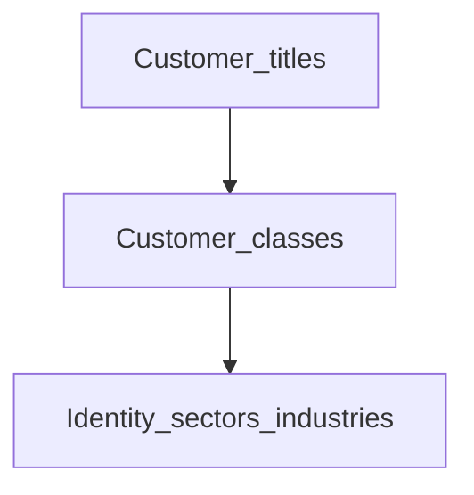

# Customer titles, classes, and related lookups

**Configure later**

## Goal

Set optional customer classification data (titles, classes, identity guidance, sectors) used on richer onboarding forms.

## Who

Administrator

## Before you start

- Basic [codes](../01-system-foundations/codes.md) already in place
- Compliance / marketing requirements for classifications

## Flow

## Steps

1. Under **Organization**, open the screens you need (titles, customer classes, contact types, identity type guides, sectors, industries, address field configuration — as available in your build).
2. Add values your onboarding forms require.
3. Keep labels stable once customers are created (renames confuse reports).

<!-- Screenshot: docs/user-guide/assets/admin/02-organization/11-customer-lookups.png -->
**Screenshot placeholder:** `assets/admin/02-organization/11-customer-lookups.png`

## What good looks like

- Optional onboarding fields show your institution’s vocabulary

## If something goes wrong

| What you see | What to try |
|--------------|-------------|
| Field missing on customer form | Confirm the feature is enabled and values exist |

## Related

- Phase overview: [Organization](README.md)
