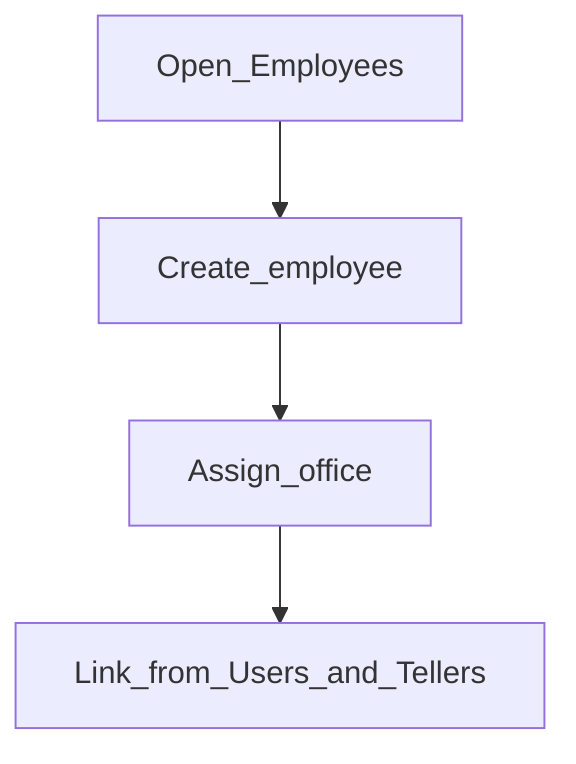

# Employees

**Required for day-to-day**

## Goal

Create staff records (loan officers, cashiers, and other employees) that users and tellers can be linked to.

## Who

Administrator

## Before you start

- [Offices](offices.md) exist
- Staff roster with office assignments

## Flow

## Steps

1. Go to **Organization → Employees** (`/organization/employees`).
2. Create an employee for each person who will be a loan officer, cashier, or similar.
3. Assign the correct office.
4. Note the names — you will select them again under Users and Tellers in [Phase 5](../05-access-and-tellers/README.md).

<!-- Screenshot: docs/user-guide/assets/admin/02-organization/08-employees-list.png -->
**Screenshot placeholder:** `assets/admin/02-organization/08-employees-list.png`

<!-- Screenshot: docs/user-guide/assets/admin/02-organization/09-create-employee.png -->
**Screenshot placeholder:** `assets/admin/02-organization/09-create-employee.png`

## What good looks like

- Every active loan officer / cashier has an employee row
- Office on the employee matches where they work

## If something goes wrong

| What you see | What to try |
|--------------|-------------|
| Cannot pick staff on a teller | Confirm the employee exists and is linked to the same office |

## Related

- Previous: [Payment types](payment-types.md)
- Next: [Legal tenders](legal-tenders.md) (if cash) or [Accounting](../03-accounting/README.md)
