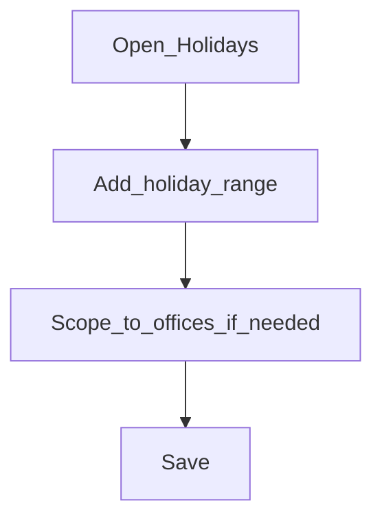

# Holidays

**Required for day-to-day**

## Goal

Register holidays that shift repayments or block processing for the current year (and maintain yearly).

## Who

Administrator

## Before you start

- [Working days](working-days.md) set
- Official holiday list for the operating year

## Flow

## Steps

1. Go to **Organization → Holidays** (`/organization/holidays`).
2. Create holidays with name, dates, and rescheduling behaviour your policy requires.
3. Limit to specific offices when a holiday is regional.
4. Activate / approve per your UI flow so the holiday takes effect.

<!-- Screenshot: docs/user-guide/assets/admin/02-organization/05-holidays-list.png -->
**Screenshot placeholder:** `assets/admin/02-organization/05-holidays-list.png`

<!-- Screenshot: docs/user-guide/assets/admin/02-organization/06-create-holiday.png -->
**Screenshot placeholder:** `assets/admin/02-organization/06-create-holiday.png`

## What good looks like

- Current-year public holidays are listed and active
- Loan officers understand how repayments move across holidays

## If something goes wrong

| What you see | What to try |
|--------------|-------------|
| Holiday not applied | Confirm status (draft vs active) and office scope |

## Related

- Previous: [Working days](working-days.md)
- Next: [Payment types](payment-types.md)
