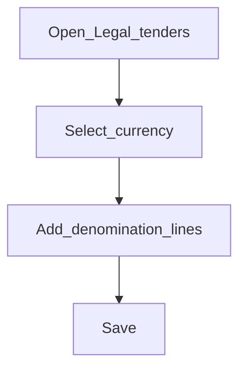

# Legal tenders

**Required for day-to-day** when you run cash desks / tellers. Otherwise **Configure later**.

## Goal

Define cash denominations (notes and coins) used when tellers count and move cash.

## Who

Administrator

## Before you start

- [Currencies](currencies.md) enabled for cash currencies
- Denomination list from cash operations

## Flow

## Steps

1. Go to **Organization → Legal tenders** (`/organization/legal-tenders`).
2. Configure tenders for each cash currency.
3. Add denomination lines (value and label) matching notes and coins in circulation.
4. Save before creating teller cashiers that handle cash.

<!-- Screenshot: docs/user-guide/assets/admin/02-organization/10-legal-tenders.png -->
**Screenshot placeholder:** `assets/admin/02-organization/10-legal-tenders.png`

## What good looks like

- Cashier cash movements offer the expected denominations
- Counts reconcile to physical notes/coins

## If something goes wrong

| What you see | What to try |
|--------------|-------------|
| No denominations on cash UI | Confirm tender lines exist for that currency |

## Related

- Previous: [Employees](employees.md)
- Next phase: [Accounting](../03-accounting/README.md)
- Configure later: [Customer lookups](customer-lookups.md), [Password preferences](password-preferences.md)
