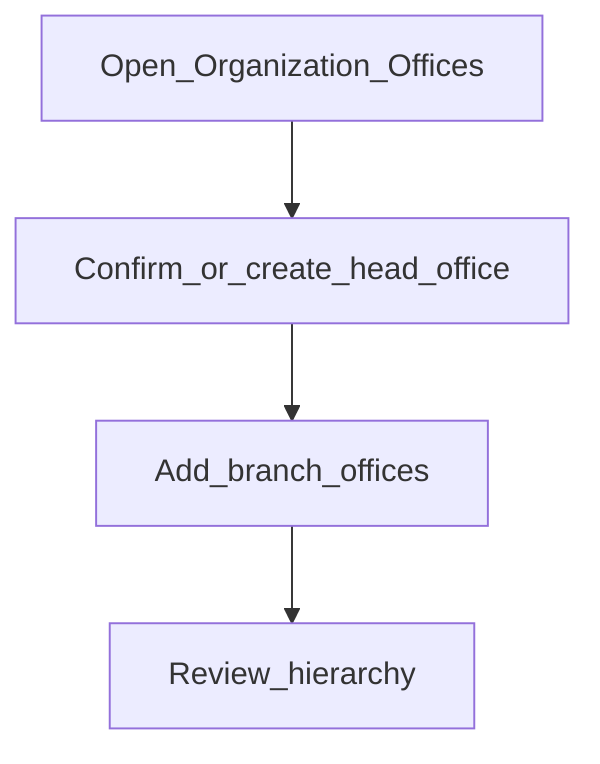

# Offices (branches)

**Required for day-to-day**

## Goal

Create the office hierarchy so customers, users, and accounts can be attached to the correct branch.

## Who

Administrator

## Before you start

- Signed in ([Phase 0](../00-access-and-servers/sign-in.md))
- Agreed branch names and parent/child structure (head office → branches)

## Flow

## Steps

1. Go to **Organization → Offices** (`/organization/offices`).
2. Review the existing root / head office. Create it if your tenant starts empty.
3. Create each branch office under the correct parent. Use clear names tellers and loan officers will recognize.
4. Confirm the list or tree shows the hierarchy you expect.

<!-- Screenshot: docs/user-guide/assets/admin/02-organization/01-offices-list.png -->
**Screenshot placeholder:** `assets/admin/02-organization/01-offices-list.png` — offices list or tree.

<!-- Screenshot: docs/user-guide/assets/admin/02-organization/02-create-office.png -->
**Screenshot placeholder:** `assets/admin/02-organization/02-create-office.png` — create office form with parent selected.

## What good looks like

- Every branch that will serve customers exists
- Parent relationships match your real organization chart
- Later user and teller screens can pick these offices

## If something goes wrong

| What you see | What to try |
|--------------|-------------|
| Cannot create under a parent | Confirm the parent office exists and is active |
| Wrong office on a user later | Edit the user (Phase 5) and reselect office |

## Related

- Next: [Currencies](currencies.md)
