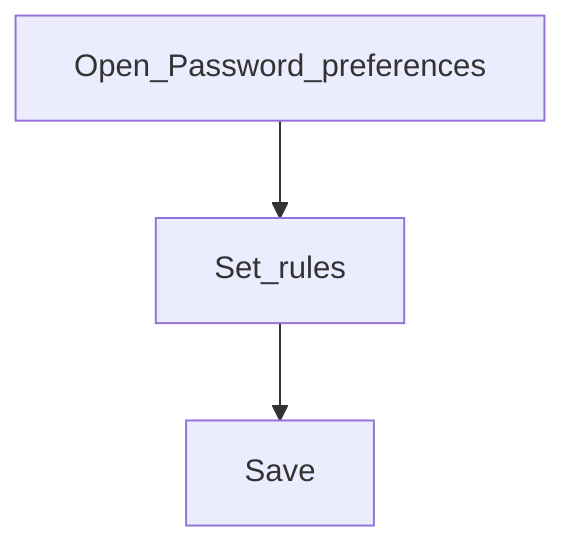

# Password preferences

**Configure later**

## Goal

Set password complexity and expiry rules for application users.

## Who

Administrator

## Before you start

- Security policy from IT / compliance

## Flow

## Steps

1. Go to **Organization → Password preferences** (`/organization/password-preferences`).
2. Align length, complexity, and expiry with policy.
3. Save before bulk-creating users in Phase 5.

<!-- Screenshot: docs/user-guide/assets/admin/02-organization/12-password-preferences.png -->
**Screenshot placeholder:** `assets/admin/02-organization/12-password-preferences.png`

## What good looks like

- New users must meet the policy when setting passwords

## If something goes wrong

| What you see | What to try |
|--------------|-------------|
| Users cannot set a password | Relax or clarify the rule; communicate requirements |

## Related

- Next phase: [Accounting](../03-accounting/README.md)
