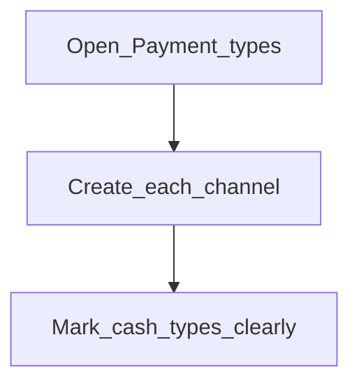

# Payment types

**Required for day-to-day**

## Goal

Define how money moves (cash, bank transfer, mobile money, and so on) so tellers and accountants pick the right method.

## Who

Administrator

## Before you start

- List of payment channels your institution accepts

## Flow

## Steps

1. Go to **Organization → Payment types** (`/organization/payment-types`).
2. Create each payment type with a clear name.
3. Flag cash vs non-cash appropriately if the form offers that distinction (matters for tellers).
4. Confirm the list covers every channel products and journals will use.

<!-- Screenshot: docs/user-guide/assets/admin/02-organization/07-payment-types.png -->
**Screenshot placeholder:** `assets/admin/02-organization/07-payment-types.png`

## What good looks like

- Tellers see the expected payment methods on deposit/withdrawal screens
- Reports can filter by the same labels

## If something goes wrong

| What you see | What to try |
|--------------|-------------|
| Missing method on a transaction form | Add the payment type here; refresh the transaction page |

## Related

- Previous: [Holidays](holidays.md)
- Next: [Employees](employees.md)
