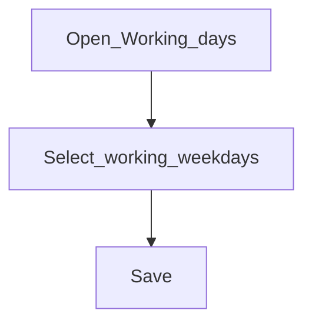

# Working days

**Required for day-to-day**

## Goal

Define which weekdays are working days so schedules and repayments align with your calendar.

## Who

Administrator

## Before you start

- Institutional policy for weekend / midweek closures

## Flow

## Steps

1. Go to **Organization → Working days** (`/organization/working-days`).
2. Mark the days your branches operate.
3. Save. Pair this with [Holidays](holidays.md) for one-off closures.

<!-- Screenshot: docs/user-guide/assets/admin/02-organization/04-working-days.png -->
**Screenshot placeholder:** `assets/admin/02-organization/04-working-days.png`

## What good looks like

- Working pattern matches branch opening hours policy
- Loan schedules do not assume open days that are always closed

## If something goes wrong

| What you see | What to try |
|--------------|-------------|
| Schedule lands on Sunday unexpectedly | Recheck working days and holiday calendar |

## Related

- Previous: [Currencies](currencies.md)
- Next: [Holidays](holidays.md)
