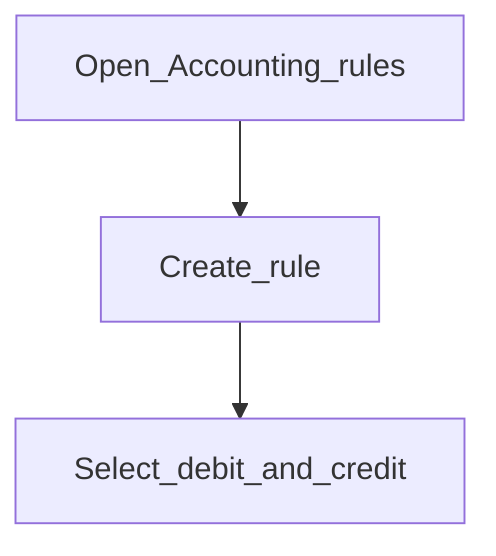

# Accounting rules

**Required for day-to-day** when you use frequent postings or rule-driven journals. Otherwise **Configure later**.

## Goal

Define reusable debit/credit patterns for common manual journals.

## Who

Administrator / accountant

## Before you start

- [Chart of accounts](chart-of-accounts.md)

## Flow

## Steps

1. Go to **Accounting → Accounting rules** (`/accounting/accounting-rules`).
2. Create rules for recurring postings your accountants use.
3. Confirm office and account constraints match policy.

<!-- Screenshot: docs/user-guide/assets/admin/03-accounting/03-accounting-rules.png -->
**Screenshot placeholder:** `assets/admin/03-accounting/03-accounting-rules.png`

## What good looks like

- Frequent postings / rule-based journals list your rules

## If something goes wrong

| What you see | What to try |
|--------------|-------------|
| Rule missing on frequent postings | Confirm rule is active and office-scoped correctly |

## Related

- Next phase: [Products](../04-products/README.md)
- Configure later: [Departments](departments.md), [Migrate opening balances](migrate-opening-balances.md)
