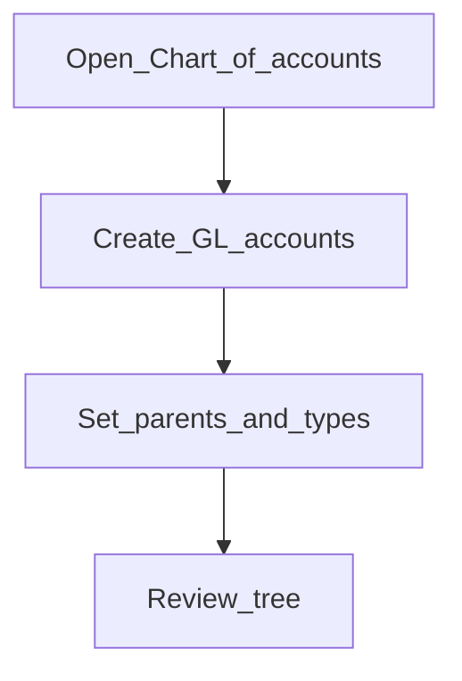

# Chart of accounts

**Required for day-to-day**

## Goal

Build the general ledger structure (assets, liabilities, equity, income, expenses) products and journals will post to.

## Who

Administrator / accountant lead

## Before you start

- [Currencies](../02-organization/currencies.md) enabled
- Chart design from your accountant

## Flow

## Steps

1. Go to **Accounting → Chart of accounts** (`/accounting/chart-of-accounts`).
2. Create GL accounts with correct type, usage, and currency as needed.
3. Nest accounts under parents where your chart uses hierarchy.
4. Spot-check that cash, loan portfolio, and income/expense control accounts exist before mapping products.

<!-- Screenshot: docs/user-guide/assets/admin/03-accounting/01-coa.png -->
**Screenshot placeholder:** `assets/admin/03-accounting/01-coa.png`

## What good looks like

- Required control accounts exist and are active
- Accountants recognize the chart structure

## If something goes wrong

| What you see | What to try |
|--------------|-------------|
| Cannot map a product GL | Confirm account type/usage matches what the product expects |

## Related

- Next: [Financial activity mappings](financial-activity-mappings.md)
