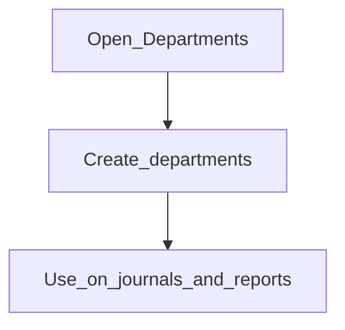

# Departments

**Configure later**

## Goal

Create cost centres / departments for departmental reporting and journal tagging.

## Who

Administrator / accountant

## Before you start

- Chart of accounts in place

## Flow

## Steps

1. Go to **Accounting → Departments** (`/accounting/departments`).
2. Create departments your P&amp;L or management reports need.
3. Train accountants to select department on manual journals when required.

<!-- Screenshot: docs/user-guide/assets/admin/03-accounting/04-departments.png -->
**Screenshot placeholder:** `assets/admin/03-accounting/04-departments.png`

## What good looks like

- Department filters appear on relevant reports with your values

## If something goes wrong

| What you see | What to try |
|--------------|-------------|
| Department required but empty | Add departments here; refresh journal form |

## Related

- Phase overview: [Accounting](README.md)
