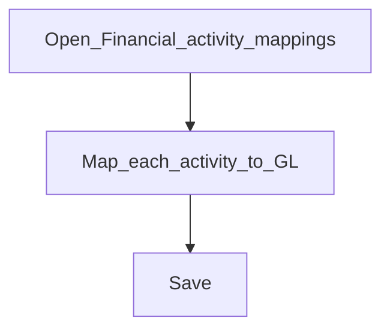

# Financial activity mappings

**Required for day-to-day**

## Goal

Map system financial activities (for example asset transfer, cash at vault) to GL accounts so automatic postings know where to go.

## Who

Administrator / accountant lead

## Before you start

- [Chart of accounts](chart-of-accounts.md) with the target GL accounts

## Flow

## Steps

1. Go to **Accounting → Financial activity mappings** (`/accounting/financial-activity-mappings`).
2. Create or edit mappings so each required activity points at the correct GL account.
3. Save and resolve any unmapped activities your products will trigger.

<!-- Screenshot: docs/user-guide/assets/admin/03-accounting/02-financial-activity-mappings.png -->
**Screenshot placeholder:** `assets/admin/03-accounting/02-financial-activity-mappings.png`

## What good looks like

- No “missing financial activity mapping” errors when opening accounts or posting

## If something goes wrong

| What you see | What to try |
|--------------|-------------|
| Posting fails naming an activity | Add that mapping here to a valid GL account |

## Related

- Previous: [Chart of accounts](chart-of-accounts.md)
- Next: [Accounting rules](accounting-rules.md)
