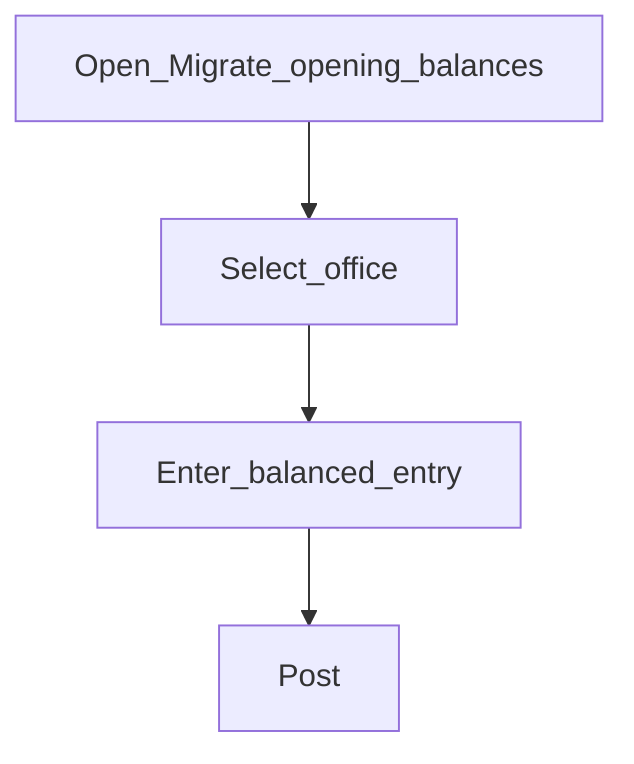

# Migrate opening balances

**Configure later** (go-live cutover)

## Goal

Load opening balances into the ledger when migrating from a prior system.

## Who

Administrator / accountant (with cutover plan)

## Before you start

- Final trial balance from the legacy system
- [Chart of accounts](chart-of-accounts.md) aligned to that trial balance

## Flow

## Steps

1. Go to **Accounting → Migrate opening balances** (`/accounting/migrate-opening-balances`).
2. Select office and enter lines that balance.
3. Post only during an agreed cutover window.
4. Run [Trial balance](../08-reports-and-go-live/financial-reports.md) to verify.

<!-- Screenshot: docs/user-guide/assets/admin/03-accounting/05-migrate-opening-balances.png -->
**Screenshot placeholder:** `assets/admin/03-accounting/05-migrate-opening-balances.png`

## What good looks like

- Opening entry balances; trial balance matches legacy control totals

## If something goes wrong

| What you see | What to try |
|--------------|-------------|
| Entry will not post unbalanced | Fix debit/credit totals before posting |

## Related

- Next phase: [Products](../04-products/README.md)
