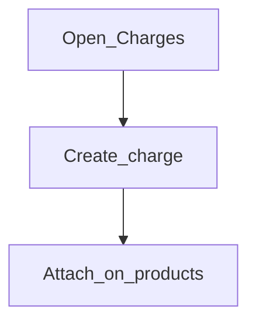

# Charges

**Required for day-to-day**

## Goal

Define fees and penalties you will attach to loan or savings products.

## Who

Administrator / product owner

## Before you start

- [Currencies](../02-organization/currencies.md)
- Fee schedule from product policy

## Flow

## Steps

1. Go to **Products → Charges** (`/products/charges`).
2. Create each charge (amount or percent, timing, currency).
3. Keep names clear for statements and tellers.
4. Attach charges when building loan/savings products next.

<!-- Screenshot: docs/user-guide/assets/admin/04-products/01-charges.png -->
**Screenshot placeholder:** `assets/admin/04-products/01-charges.png`

## What good looks like

- Charges appear in product charge pickers
- Currency matches the products that will use them

## If something goes wrong

| What you see | What to try |
|--------------|-------------|
| Charge missing on product | Confirm charge is active and currency-compatible |

## Related

- Next: [Loan products](loan-products.md) / [Savings products](savings-products.md)
