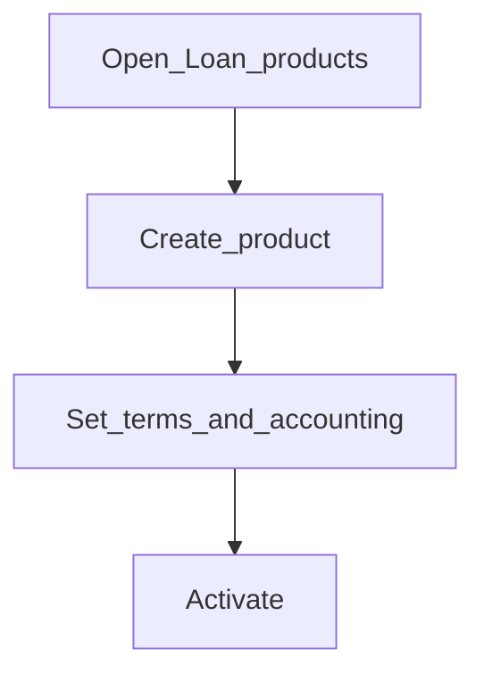

# Loan products

**Required for day-to-day** if you originate loans.

## Goal

Publish at least one loan product with terms, accounting, and charges your loan officers can offer.

## Who

Administrator / product owner

## Before you start

- [Charges](charges.md), [COA](../03-accounting/chart-of-accounts.md), [Financial activity mappings](../03-accounting/financial-activity-mappings.md)

## Flow

## Steps

1. Go to **Products → Loan products** (`/products/loan-products`).
2. Create a product: general details, terms, charges, accounting mappings.
3. Review every GL mapping carefully before activation.
4. Activate when ready for loan officers to use.

<!-- Screenshot: docs/user-guide/assets/admin/04-products/02-loan-products.png -->
**Screenshot placeholder:** `assets/admin/04-products/02-loan-products.png`

## What good looks like

- Product is active and selectable when creating a loan
- Test disbursement in smoke (Phase 8) posts as expected

## If something goes wrong

| What you see | What to try |
|--------------|-------------|
| Accounting validation errors | Fix GL mappings; confirm financial activity mappings |

## Related

- Also see: [Savings products](savings-products.md)
- Next phase: [Access, staff, and tellers](../05-access-and-tellers/README.md)
