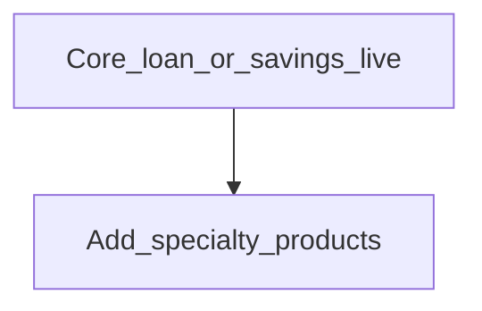

# Other products

**Configure later**

## Goal

Add share products, fixed/recurring deposits, tax configurations, floating rates, delinquency buckets, or product mix after the core loan/savings path works.

## Who

Administrator / product owner

## Before you start

- At least one core [loan](loan-products.md) or [savings](savings-products.md) product live

## Flow

## Steps

1. Under **Products**, open the specialty area you need (shares, deposits, tax, floating rates, delinquency, product mix).
2. Configure using the same care for accounting mappings as core products.
3. Activate only when staff are trained.

<!-- Screenshot: docs/user-guide/assets/admin/04-products/04-other-products.png -->
**Screenshot placeholder:** `assets/admin/04-products/04-other-products.png`

## What good looks like

- Specialty products appear only where intended; core path remains stable

## If something goes wrong

| What you see | What to try |
|--------------|-------------|
| Accounting errors on specialty product | Revisit COA mappings before activating |

## Related

- Phase overview: [Products](README.md)
