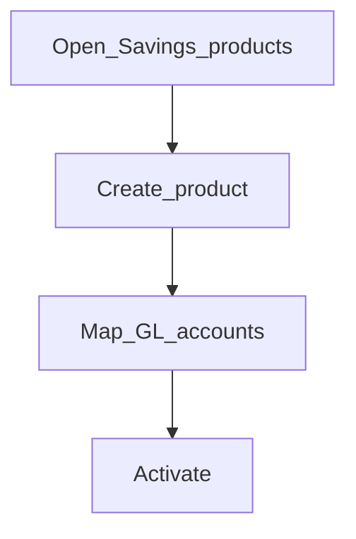

# Savings products

**Required for day-to-day** if you take savings deposits.

## Goal

Publish at least one savings product with interest, charges, and accounting configured.

## Who

Administrator / product owner

## Before you start

- [Charges](charges.md) and accounting foundation ([Phase 3](../03-accounting/README.md))

## Flow

## Steps

1. Go to **Products → Savings products** (`/products/savings-products`).
2. Create the product (terms, interest, charges, accounting).
3. Activate when ready for account opening.

<!-- Screenshot: docs/user-guide/assets/admin/04-products/03-savings-products.png -->
**Screenshot placeholder:** `assets/admin/04-products/03-savings-products.png`

## What good looks like

- Product is active on “open savings” flows
- Test deposit in smoke (Phase 8) posts correctly

## If something goes wrong

| What you see | What to try |
|--------------|-------------|
| Cannot open account | Confirm product active and office/currency allowed |

## Related

- Also see: [Loan products](loan-products.md)
- Configure later: [Other products](other-products.md)
