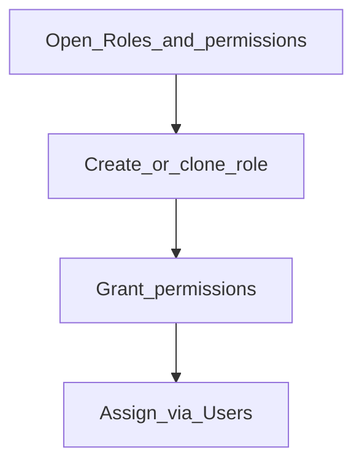

# Roles and permissions

**Required for day-to-day**

## Goal

Define roles (teller, loan officer, checker, accountant, admin) with the rights each job needs — no more, no less.

## Who

Administrator

## Before you start

- Job descriptions for each role
- Awareness of maker-checker / workflow needs ([Phase 6](../06-maker-checker/README.md))

## Flow

## Steps

1. Go to **System → Roles and permissions** (`/system/roles-and-permissions`).
2. Create roles that match real jobs. Prefer cloning a similar role then trimming rights.
3. Grant only what that job needs (customers, loans, savings, journals, checker tasks, and so on).
4. Save. You will attach roles when creating users next.

<!-- Screenshot: docs/user-guide/assets/admin/05-access-and-tellers/01-roles.png -->
**Screenshot placeholder:** `assets/admin/05-access-and-tellers/01-roles.png`

## What good looks like

- Each day-to-day role exists
- Admin-only rights are not on teller/loan officer roles

## If something goes wrong

| What you see | What to try |
|--------------|-------------|
| User cannot open a screen | Add the missing permission to their role; user re-signs in if needed |

## Related

- Next: [Users](users.md)
