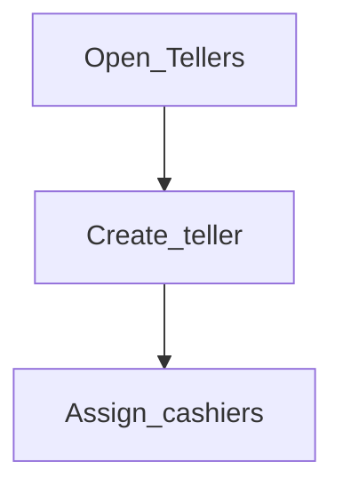

# Tellers

**Required for day-to-day** when you run cash desks.

## Goal

Set up tellers and cashiers so cash sessions and cash transactions can be attributed correctly.

## Who

Administrator

## Before you start

- [Offices](../02-organization/offices.md), [Employees](../02-organization/employees.md), [Legal tenders](../02-organization/legal-tenders.md), [Users](users.md)

## Flow

## Steps

1. Go to **Organization → Tellers** (`/organization/tellers`).
2. Create a teller for each cash desk / vault point.
3. Assign cashiers (staff) with valid date ranges and amounts per your cash policy.
4. Confirm teller users can open a cashier session in day-to-day use (Volume 2).

<!-- Screenshot: docs/user-guide/assets/admin/05-access-and-tellers/03-tellers.png -->
**Screenshot placeholder:** `assets/admin/05-access-and-tellers/03-tellers.png`

## What good looks like

- Each cash desk has an active teller and cashier assignment
- Cash transactions require / show the cashier where configured

## If something goes wrong

| What you see | What to try |
|--------------|-------------|
| Cannot assign cashier | Confirm employee exists for that office |

## Related

- Next phase: [Maker-checker and workflows](../06-maker-checker/README.md)
- Configure later: [Templates](templates.md)
