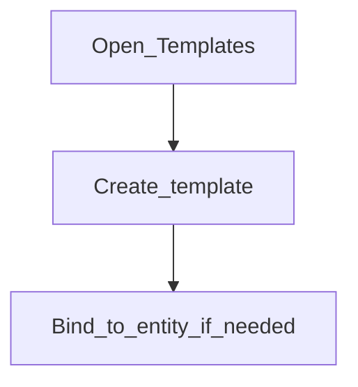

# Templates

**Configure later**

## Goal

Configure document or messaging templates used for letters, SMS, or similar outputs.

## Who

Administrator

## Before you start

- External services for email/SMS if templates send messages ([Phase 1](../01-system-foundations/external-services.md))

## Flow

## Steps

1. Go to **Administration → Templates** (`/templates`).
2. Create templates your operations need.
3. Test with a non-production customer before relying on them in production.

<!-- Screenshot: docs/user-guide/assets/admin/05-access-and-tellers/04-templates.png -->
**Screenshot placeholder:** `assets/admin/05-access-and-tellers/04-templates.png`

## What good looks like

- Staff can generate the expected document or message from a customer or account

## If something goes wrong

| What you see | What to try |
|--------------|-------------|
| Send fails | Check external services configuration |

## Related

- Phase overview: [Access, staff, and tellers](README.md)
