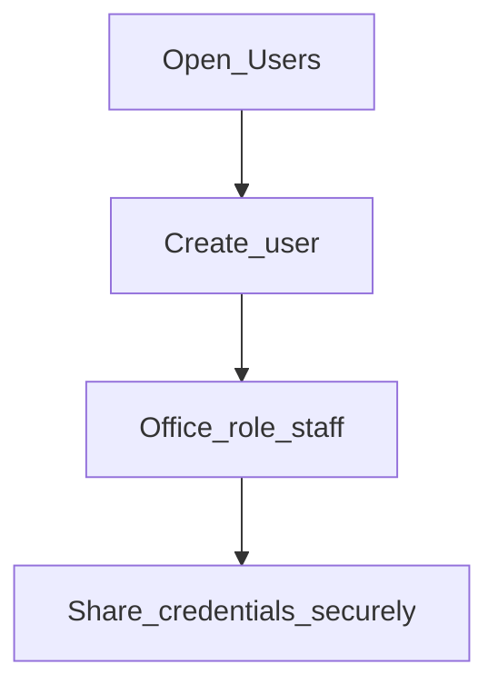

# Users

**Required for day-to-day**

## Goal

Create application users, map them to offices and roles, and link staff where required.

## Who

Administrator

## Before you start

- [Roles](roles-and-permissions.md), [Offices](../02-organization/offices.md), [Employees](../02-organization/employees.md)
- [Password preferences](../02-organization/password-preferences.md) if already set

## Flow

## Steps

1. Go to **Administration → Users** (`/appusers`).
2. Create each user with username, office, and role(s).
3. Link the related employee when the UI requires it (loan officers, cashiers).
4. Share initial credentials through your secure channel; require password change on first login if policy demands it.

<!-- Screenshot: docs/user-guide/assets/admin/05-access-and-tellers/02-users.png -->
**Screenshot placeholder:** `assets/admin/05-access-and-tellers/02-users.png`

## What good looks like

- Each staff member who needs the app has a user
- Office and role match their job
- Test sign-in succeeds for a non-admin role

## If something goes wrong

| What you see | What to try |
|--------------|-------------|
| User sees empty navigation | Permissions missing on role; or wrong office restrictions |

## Related

- Previous: [Roles and permissions](roles-and-permissions.md)
- Next: [Tellers](tellers.md)
