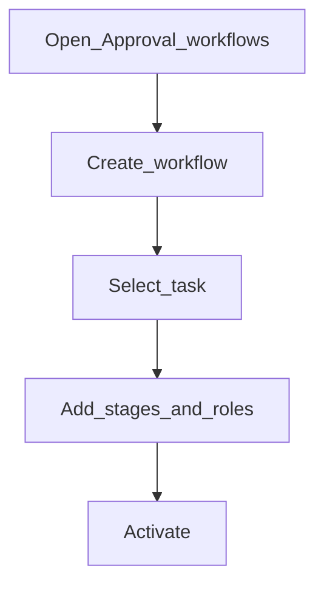

# Approval workflows

**Required for day-to-day** if you use multi-stage approval workflows. Otherwise **Configure later**.

## Goal

Define staged approval workflows for specific maker-checker tasks (review → approve, and so on).

## Who

Administrator

## Before you start

- Maker-checker enabled for the target task ([maker-checker-tasks.md](maker-checker-tasks.md))
- Roles that will act as stage checkers

## Flow

## Steps

1. Go to **System → Approval workflows** (`/system/approval-workflows`).
2. Create a workflow: choose the task, name it, add stages with roles and policies.
3. Activate only when stages and roles are correct.
4. Prefer inactive scheduler jobs are not confused with workflow tasks — workflows bind to maker-checker **tasks**.

<!-- Screenshot: docs/user-guide/assets/admin/06-maker-checker/02-approval-workflows.png -->
**Screenshot placeholder:** `assets/admin/06-maker-checker/02-approval-workflows.png`

## What good looks like

- Creating a matching maker action routes into the workflow
- Checkers see stages in the checker inbox

## If something goes wrong

| What you see | What to try |
|--------------|-------------|
| Cannot activate | Maker-checker may be off for that task — enable it first |
| Duplicate task names in picker | Prefer the clean task name; ask admin to clean trailing-space duplicates in permissions if still present |

## Related

- Next: [Verify checker inbox](verify-checker-inbox.md)
