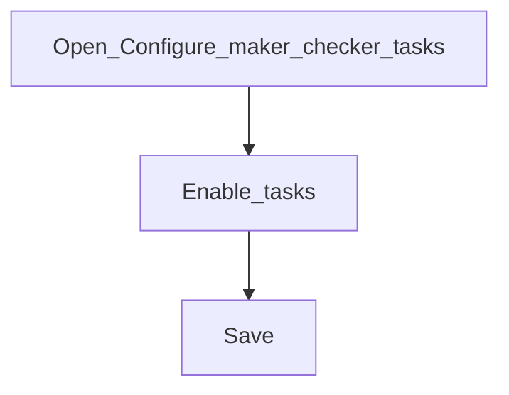

# Configure maker-checker tasks

**Required for day-to-day** if dual control is institution policy. Otherwise **Configure later**.

## Goal

Turn maker-checker on for the operations that must be approved by a second person.

## Who

Administrator

## Before you start

- Global maker-checker (or related) configuration understood ([Phase 1](../01-system-foundations/global-configurations.md))
- Checker roles exist ([Phase 5](../05-access-and-tellers/roles-and-permissions.md))

## Flow

## Steps

1. Go to **System → Configure maker checker tasks** (`/system/configure-mc-tasks`).
2. Enable only the tasks that require a second pair of eyes (avoid enabling everything “just in case”).
3. Save. Confirm checker roles include rights to approve those tasks.

<!-- Screenshot: docs/user-guide/assets/admin/06-maker-checker/01-mc-tasks.png -->
**Screenshot placeholder:** `assets/admin/06-maker-checker/01-mc-tasks.png`

## What good looks like

- Maker actions for enabled tasks wait for checker approval
- Unchecked tasks still complete immediately for makers

## If something goes wrong

| What you see | What to try |
|--------------|-------------|
| Task never appears for checker | Confirm task enabled; maker actually submitted; checker has rights |

## Related

- Next: [Approval workflows](approval-workflows.md)
