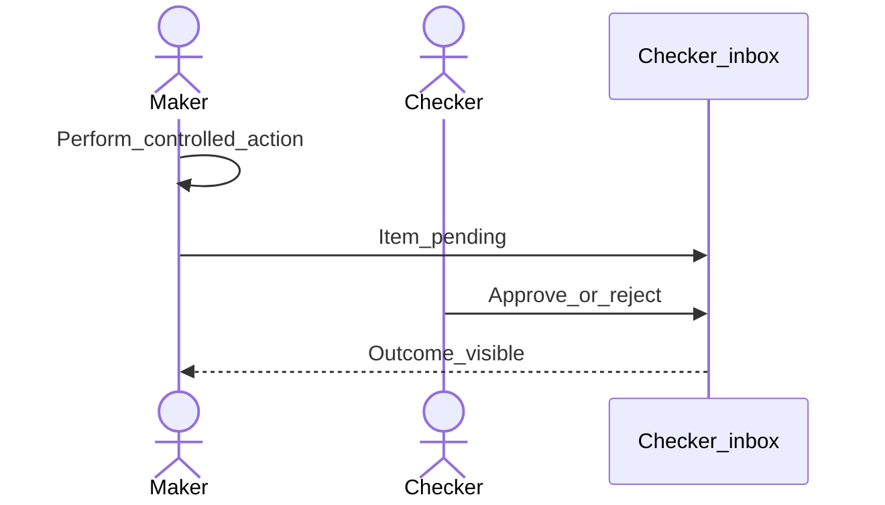

# Verify checker inbox path

**Required for day-to-day** as an admin smoke test when dual control is on.

## Goal

Prove that a maker action appears for a checker and can be approved or rejected end-to-end.

## Who

Administrator (with a test maker and checker account)

## Before you start

- [Maker-checker tasks](maker-checker-tasks.md) and optionally [Approval workflows](approval-workflows.md)
- Two test users: maker and checker

## Flow

## Steps

1. Sign in as the **maker**. Perform a small, reversible action that requires checking (prefer sandbox).
2. Sign in as the **checker**. Open **Checker inbox and tasks** (`/checker-inbox-and-tasks`).
3. Locate the pending item, open it, and approve or reject.
4. Confirm the maker-side record reflects the outcome.

<!-- Screenshot: docs/user-guide/assets/admin/06-maker-checker/03-checker-inbox.png -->
**Screenshot placeholder:** `assets/admin/06-maker-checker/03-checker-inbox.png`

## What good looks like

- Pending item appears promptly for the checker
- Approval completes the business action; rejection leaves it not applied (per product rules)

## If something goes wrong

| What you see | What to try |
|--------------|-------------|
| Empty inbox | Wrong office; task not maker-checker enabled; maker action failed validation |

## Related

- Next phase: [Jobs and schedules](../07-jobs-and-schedules/README.md)
