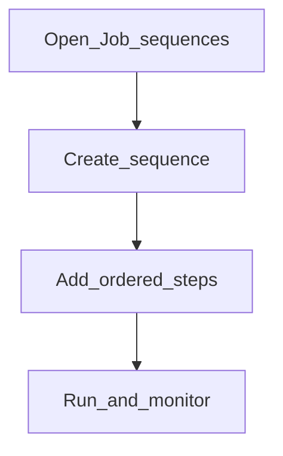

# Job sequences

**Required for day-to-day** if you orchestrate end-of-day (or similar) as an ordered sequence. Otherwise **Configure later**.

## Goal

Define an ordered sequence of scheduler jobs and platform operations (for example advance business date), then run and monitor it.

## Who

Administrator

## Before you start

- Jobs created/activated as needed ([manage-jobs.md](manage-jobs.md))
- Short names available for each scheduler step

## Flow

## Steps

1. Go to **System → Job sequences** (`/system/job-sequences`).
2. Create a sequence (name, active flag, steps).
3. Add steps in order: scheduler jobs by short name and/or platform operations.
4. If a selected job is **inactive**, the UI warns it will be **skipped at run time** until activated under Manage jobs.
5. Run the sequence and open the run detail to confirm each step completed or was skipped intentionally.

<!-- Screenshot: docs/user-guide/assets/admin/07-jobs-and-schedules/02-job-sequences.png -->
**Screenshot placeholder:** `assets/admin/07-jobs-and-schedules/02-job-sequences.png`

<!-- Screenshot: docs/user-guide/assets/admin/07-jobs-and-schedules/03-sequence-run.png -->
**Screenshot placeholder:** `assets/admin/07-jobs-and-schedules/03-sequence-run.png` — run detail with Completed / Skipped, inactive.

## What good looks like

- Sequence run finishes without unexpected failures
- Inactive jobs show as skipped; remaining steps continue
- Business date / postings match the intended end-of-day outcome

## If something goes wrong

| What you see | What to try |
|--------------|-------------|
| Step failed | Fix the underlying job; re-run after correcting data/date |
| Job skipped unexpectedly | Activate it under Manage jobs |

## Related

- Next phase: [Reports and go-live](../08-reports-and-go-live/README.md)
