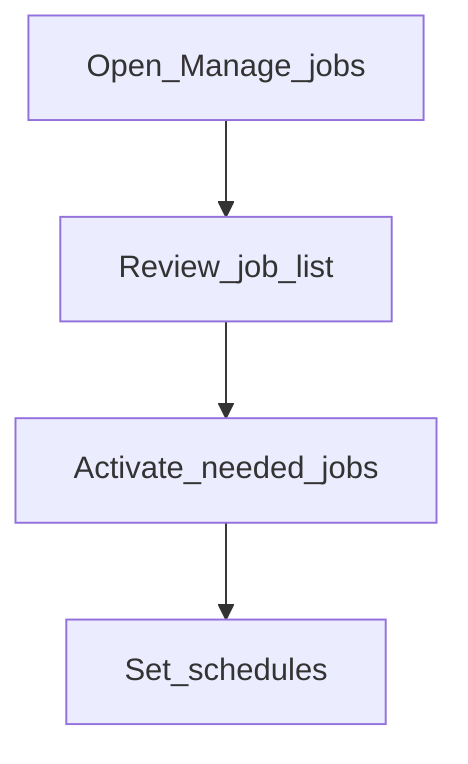

# Manage jobs

**Required for day-to-day** when interest, COB, or other scheduled processing must run.

## Goal

Activate and schedule the jobs your institution depends on; leave unused jobs inactive.

## Who

Administrator

## Before you start

- Understanding which jobs finance/ops expect nightly or intraday
- Business date process agreed ([Phase 1](../01-system-foundations/business-date.md))

## Flow

## Steps

1. Go to **System → Manage jobs** (`/system/manage-jobs`).
2. Identify jobs required for your products (interest posting, COB-related jobs, and so on).
3. Activate those jobs and set schedules. Leave others inactive.
4. Note **short names** — you will need them for [job sequences](job-sequences.md).

<!-- Screenshot: docs/user-guide/assets/admin/07-jobs-and-schedules/01-manage-jobs.png -->
**Screenshot placeholder:** `assets/admin/07-jobs-and-schedules/01-manage-jobs.png`

## What good looks like

- Required jobs show as active with sensible schedules
- Manual run (if offered) succeeds in sandbox

## If something goes wrong

| What you see | What to try |
|--------------|-------------|
| Job fails when run | Read the error; confirm business date and prerequisites |

## Related

- Next: [Job sequences](job-sequences.md)
