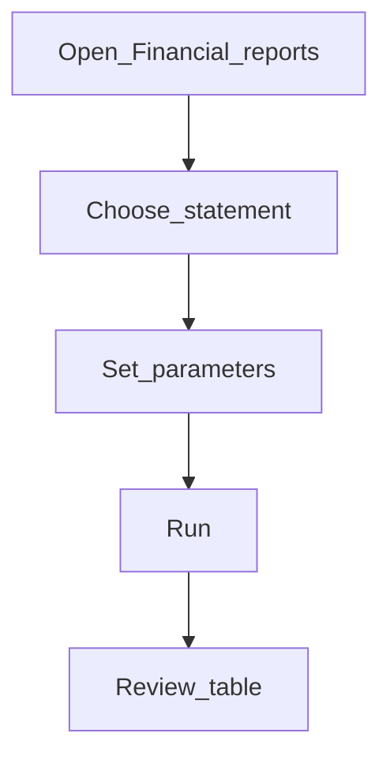

# Financial reports

**Required for day-to-day** as a control check after setup (and ongoing for accountants).

## Goal

Run Balance sheet, Income statement, and Trial balance from the dedicated **Financial reports** navigation.

## Who

Administrator (setup verification) / accountant (ongoing — also covered in Volume 2)

## Before you start

- Accounting foundation and at least one posted transaction (or opening balances)
- Permission to run reports

## Flow

## Steps

1. In the sidebar, open **Financial reports**.
2. Choose **Balance sheet**, **Income statement**, or **Trial balance** (`/financial-reports/...`).
3. Set parameters (office, dates, currency, and so on) and run.
4. Review the results table; export CSV if needed.
5. While data loads, expect a results skeleton — wait for completion before judging empty data.

<!-- Screenshot: docs/user-guide/assets/admin/08-reports-and-go-live/01-financial-reports-nav.png -->
**Screenshot placeholder:** `assets/admin/08-reports-and-go-live/01-financial-reports-nav.png`

<!-- Screenshot: docs/user-guide/assets/admin/08-reports-and-go-live/02-balance-sheet-results.png -->
**Screenshot placeholder:** `assets/admin/08-reports-and-go-live/02-balance-sheet-results.png`

## What good looks like

- Report completes without error
- Figures match expectations from a known test transaction or opening balance

## If something goes wrong

| What you see | What to try |
|--------------|-------------|
| Report not found | Confirm the standard statement reports exist and are marked for use |
| Empty results | Widen parameters; confirm postings exist for the period |

## Related

- Next: [Smoke checklist](smoke-checklist.md)
- Configure later: [Reports catalog](reports-catalog.md)
