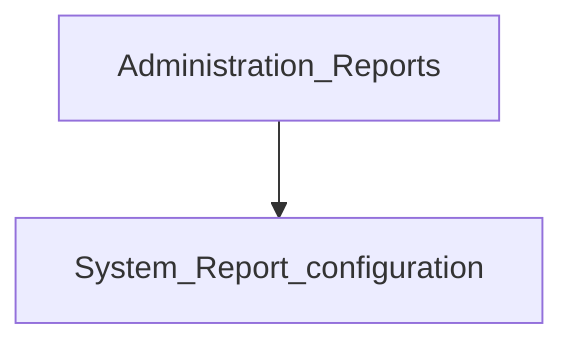

# Reports catalog and configuration

**Configure later**

## Goal

Browse the full reports catalog and, if you administer report definitions, maintain report configuration.

## Who

Administrator

## Before you start

- Financial reports path working for core statements

## Flow

## Steps

1. Use **Administration → Reports** (`/reports`) to find and run catalog reports.
2. Use **System → Reports** (`/system/reports`) only when you need to create or edit report definitions.
3. Prefer dedicated Financial reports links for the three core statements.

<!-- Screenshot: docs/user-guide/assets/admin/08-reports-and-go-live/03-reports-catalog.png -->
**Screenshot placeholder:** `assets/admin/08-reports-and-go-live/03-reports-catalog.png`

## What good looks like

- Staff can find operational reports without editing definitions
- Only trained admins change report SQL / parameters

## If something goes wrong

| What you see | What to try |
|--------------|-------------|
| Report missing from catalog | Confirm it is flagged for use; check permissions |

## Related

- [Financial reports](financial-reports.md)
