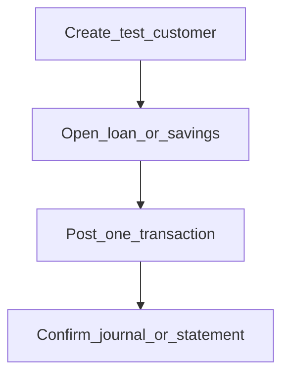

# Go-live smoke checklist

**Required for day-to-day** before handing the institution to tellers and loan officers.

## Goal

Prove the setup path works end-to-end with one safe test customer and one transaction.

## Who

Administrator (with a test maker/teller account)

## Before you start

- Phases 0–7 complete for your minimal path ([go-live checklist](../README.md#minimal-go-live-checklist))

## Flow

## Steps

1. **Create a test customer** under Portfolio → Clients (use clearly fake data in sandbox).
2. **Open** a savings or loan account using a product from Phase 4.
3. **Post one transaction** (deposit or disbursement) with a real payment type and, if cash, an open cashier.
4. **Confirm posting:** view the account transactions and, if needed, journal enquiry.
5. **Run** [Trial balance or Balance sheet](financial-reports.md) for the office/period and confirm the test activity is reflected (or explainably not, for off-balance cases).
6. If dual control is on, repeat a small maker action and [verify checker inbox](../06-maker-checker/verify-checker-inbox.md).

<!-- Screenshot: docs/user-guide/assets/admin/08-reports-and-go-live/04-smoke-client.png -->
**Screenshot placeholder:** `assets/admin/08-reports-and-go-live/04-smoke-client.png`

<!-- Screenshot: docs/user-guide/assets/admin/08-reports-and-go-live/05-smoke-transaction.png -->
**Screenshot placeholder:** `assets/admin/08-reports-and-go-live/05-smoke-transaction.png`

## What good looks like

- No blocking errors on customer, account, or transaction
- Ledger / financial report agrees with the test activity
- Day-to-day roles can sign in and see the screens they need

## If something goes wrong

| What you see | What to try |
|--------------|-------------|
| Accounting error on open/post | Return to Phase 3 mappings and product accounting |
| Permission denied for test user | Return to Phase 5 roles |
| Checker never sees item | Return to Phase 6 |

## Related

- Administrator TOC: [Volume 1](../README.md)
- Next volume: [Day-to-day users](../../daily/README.md)
