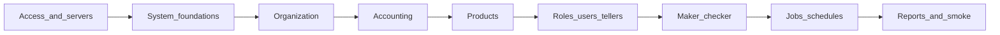

# Volume 1 — Administrator setup guide

This volume walks an administrator from **first sign-in** to an institution that is **ready for tellers and loan officers**.

Follow phases in order. Within each phase, do **Required for day-to-day** tasks first; leave **Configure later** items until after go-live if you are aiming for a minimal setup.

## Table of contents

| Phase | Folder | Ready when… |
|-------|--------|-------------|
| 0 | [Access and servers](00-access-and-servers/README.md) | Signed into the correct institution |
| 1 | [System foundations](01-system-foundations/README.md) | Business date, configs, and codes usable |
| 2 | [Organization](02-organization/README.md) | Branches, currency, calendar, staff skeleton |
| 3 | [Accounting](03-accounting/README.md) | Products can post to the general ledger |
| 4 | [Products](04-products/README.md) | At least one loan and/or savings path sellable |
| 5 | [Access, staff, and tellers](05-access-and-tellers/README.md) | Roles, users, and cashiers ready |
| 6 | [Maker-checker and workflows](06-maker-checker/README.md) | Dual control configured if required |
| 7 | [Jobs and schedules](07-jobs-and-schedules/README.md) | Accruals / COB / end-of-day runnable |
| 8 | [Reports and go-live](08-reports-and-go-live/README.md) | Smoke path works end-to-end |

## Minimal go-live checklist

Use this when you need the smallest path to day-to-day work:

- [ ] Server added and signed in ([Phase 0](00-access-and-servers/README.md))
- [ ] Global configurations and business date set ([Phase 1](01-system-foundations/README.md))
- [ ] Codes needed for clients/products present ([Phase 1](01-system-foundations/codes.md))
- [ ] Offices, currencies, working days, payment types, employees ([Phase 2](02-organization/README.md))
- [ ] Legal tenders (if cash / teller ops) ([Phase 2](02-organization/legal-tenders.md))
- [ ] Chart of accounts and financial activity mappings ([Phase 3](03-accounting/README.md))
- [ ] Charges and at least one loan or savings product ([Phase 4](04-products/README.md))
- [ ] Roles, users, tellers ([Phase 5](05-access-and-tellers/README.md))
- [ ] Maker-checker / workflows if dual control is required ([Phase 6](06-maker-checker/README.md))
- [ ] Required jobs active; job sequences if using end-of-day ([Phase 7](07-jobs-and-schedules/README.md))
- [ ] Smoke: client → account → one transaction → financial report ([Phase 8](08-reports-and-go-live/smoke-checklist.md))

## Related

- Handbook home: [User guide](../README.md)
- Day-to-day volume (later): [Volume 2](../daily/README.md)
